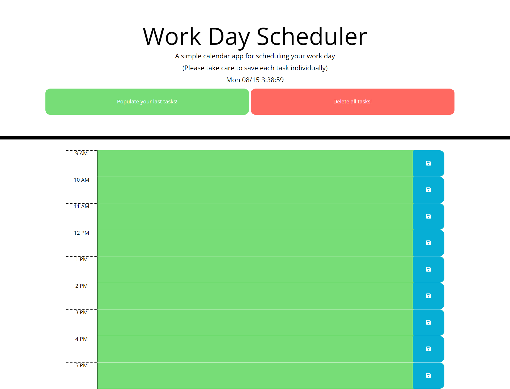

# Work-Day-Planner-Challenge05

## Table of Contents

- [Work-Day-Planner-Challenge05](#work-day-planner-challenge05)
  - [Table of Contents](#table-of-contents)
  - [Description](#description)
  - [Resources](#resources)
  - [Visuals](#visuals)
  - [Authors and Acknowledgments](#authors-and-acknowledgments)

## Description

The Challenge three assignment tasked us with creating a work day planner using the provided code.

This was accomplished by using lessons from the module as well as class time to implement jquery to make our js more efficient, bootstrap to quickly apply css to the page, and moment.js to get the time.

While the Brief does mention data persisting on refresh I built some buttons to populate your last saved data as well as a button to clear all data from the fields and local storage. This felt more appropriate as if the user would like to begin working on new tasks they could just overwrite the previous entry without deleteing everything.
## Resources

- [LIVE SITE](https://jklaver91.github.io/Work-Day-Planner-Challenge05/)

- [Repository](https://github.com/Jklaver91/Work-Day-Planner-Challenge05)

## Visuals

## Authors and Acknowledgments

Code created by Bootcamp, optimized by Justin Klaver.